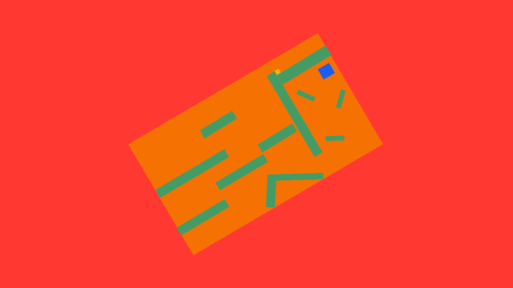
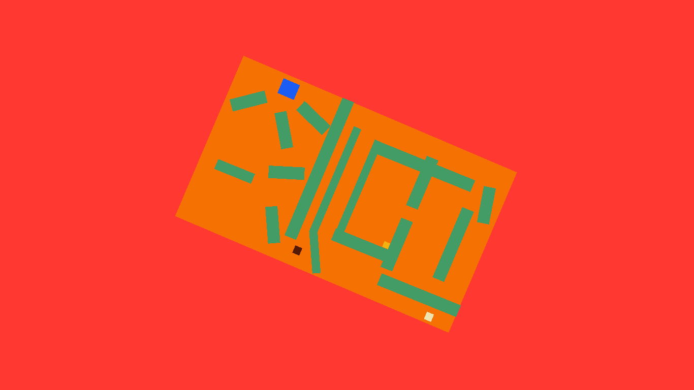
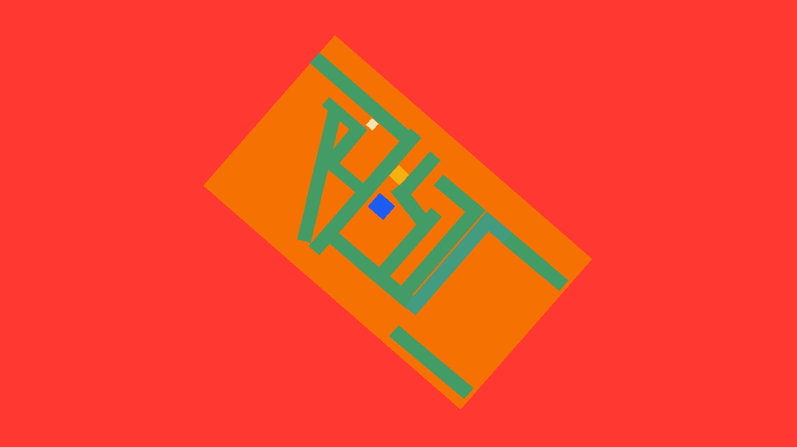
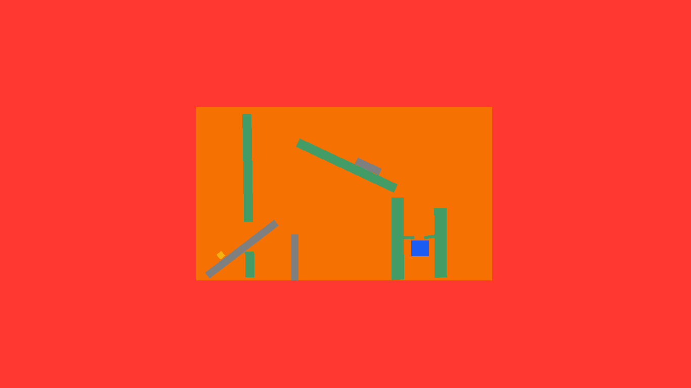

# Platform Control


This game has the players control the whole platform and try to place a cube inside it at the end point.

## Controls 

``` Mouse X-axis``` - Tilt the platform

``` Mouse Y-axis``` - Force to the box

```R```  - Restart the level


## ScreenShots





